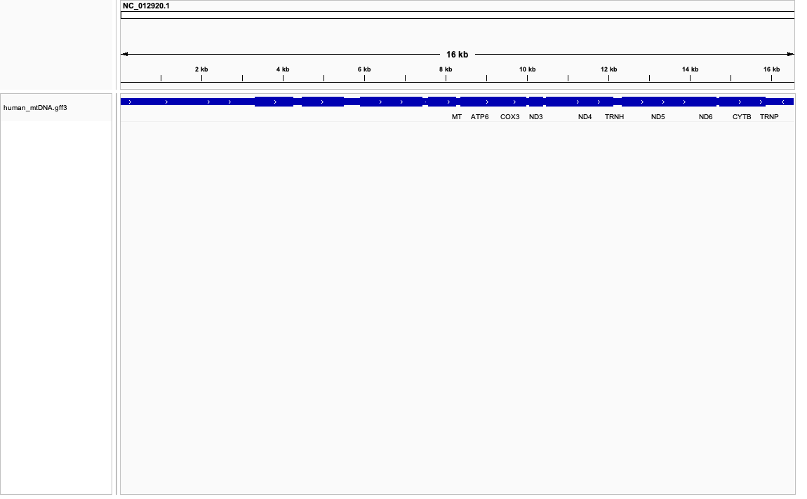
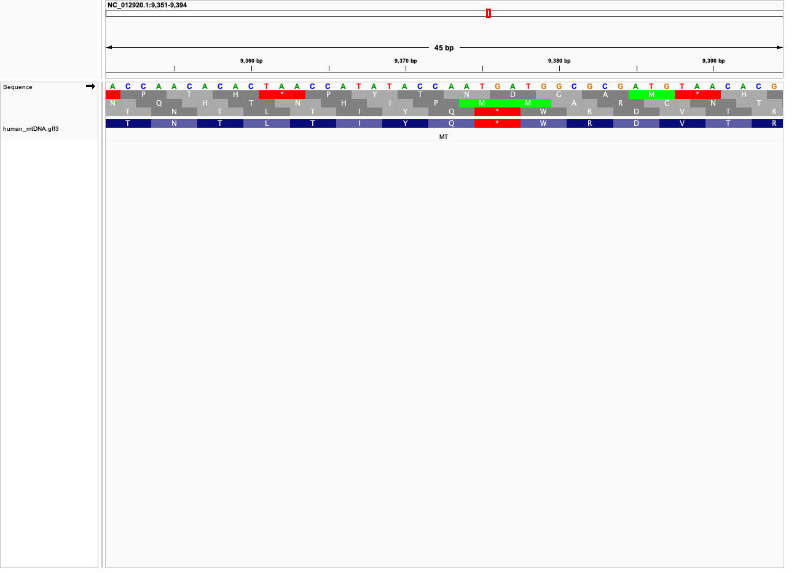
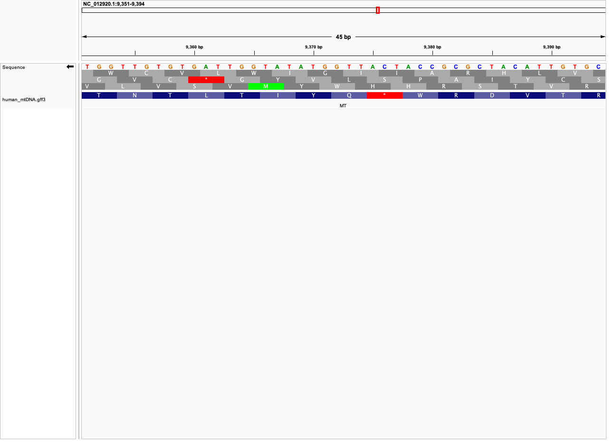
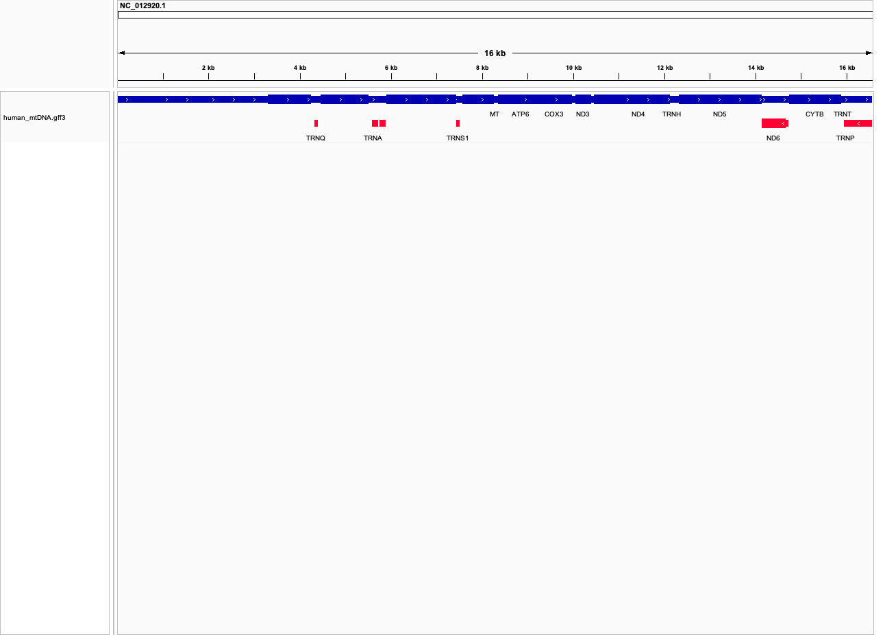

# BMMB 852 - Week 02 Assignment

## Visualizing the Human Mitochondrial Genome

For this assignment, I downloaded and visualized the human mitochondrial reference genome and its genomic annotations. I selected this genome because of my medical background and its clinical relevance to mitochondrial diseases. Its compact size also makes it useful for examining genome organization, overlapping genes, strand orientation, and reading frames.

## Genome Information

- **Organism:** *Homo sapiens*
- **Genome:** Mitochondrial genome
- **Accession:** `NC_012920.1`
- **Reference:** Revised Cambridge Reference Sequence (rCRS)
- **Repository:** NCBI RefSeq
- **Genome length:** 16,569 base pairs
- **Number of sequences/chromosomes:** 1
- **Genome structure:** Circular
- **Sequence format:** FASTA
- **Annotation format:** GFF3

## Requirements

The workflow requires `make`, `curl`, `samtools`, and `seqkit`. IGV is required for visualization.

## Directory Structure

```text
week02/
├── Makefile
├── README.md
├── data/
│   ├── human_mtDNA.fa
│   ├── human_mtDNA.fa.fai
│   └── human_mtDNA.gff3
└── images/
    ├── features_by_strand.png
    ├── forward_reading_frames.png
    ├── reverse_reading_frames.png
    └── whole_genome.png
```

The genomic files are kept in `data/`, and the IGV screenshots are kept in `images/`.

## Downloading the Data

The `Makefile` downloads the FASTA sequence and GFF3 annotation directly from NCBI and creates a FASTA index with `samtools faidx`.

```bash
make
```

This generates:

```text
data/human_mtDNA.fa
data/human_mtDNA.fa.fai
data/human_mtDNA.gff3
```

To remove the generated data:

```bash
make clean
```

## Genome Size and Chromosome Count

I examined the FASTA file using:

```bash
seqkit stats data/human_mtDNA.fa
```

```text
file                    format  type  num_seqs  sum_len  min_len  avg_len  max_len
data/human_mtDNA.fa     FASTA   DNA          1   16,569   16,569   16,569   16,569
```

The reference genome is **16,569 base pairs** long. It consists of one complete circular mitochondrial DNA molecule represented by one FASTA sequence.

## Number of Annotations

I counted all annotation records with:

```bash
awk -F '\t' '!/^#/ && NF==9 {count++} END {print count}' data/human_mtDNA.gff3
```

The GFF3 file contains **101 annotation records**:

| Feature type | Count |
| --- | ---: |
| Gene | 37 |
| CDS | 13 |
| tRNA | 22 |
| rRNA | 2 |
| Exon | 24 |
| D-loop | 1 |
| Region | 1 |
| Sequence feature | 1 |
| **Total** | **101** |

The 37 genes consist of 13 protein-coding genes, 22 tRNA genes, and 2 rRNA genes.

## Completeness of the Genome Build

In my opinion, this is a highly complete genome build. It is represented as one complete circular sequence with no reported gaps or unresolved bases. The annotation includes all 37 expected mitochondrial genes and the D-loop control region. However, `NC_012920.1` is a single human mitochondrial reference sequence and does not represent all mitochondrial variation or heteroplasmy across human populations, individuals, and tissues.

## Visualization in IGV

I loaded `data/human_mtDNA.fa` into IGV as the reference genome and `data/human_mtDNA.gff3` as an annotation track.

### Whole Mitochondrial Genome



## Visualization Questions

### 1. How tightly packed are the genes?

The genes are very tightly packed. Most adjacent genes are separated by approximately **0-10 base pairs**, and some overlap. For example, `ATP8` spans positions 8,366-8,572, while `ATP6` begins at position 8,527; therefore, these protein-coding genes overlap by approximately **46 base pairs**.

### 2. Coordinate selected for visual inspection

I inspected coordinate **9,363** within the region `NC_012920.1:9,351-9,394`. This coordinate lies within the mitochondrial `COX3` protein-coding region. At this magnification, IGV displays individual DNA bases and their amino-acid translations.

### 3. Six possible reading frames

A double-stranded DNA sequence has three reading frames on the forward strand and three on the reverse strand. At coordinate 9,363, the possible codons are:

| Orientation | Codon | Translation |
| --- | --- | --- |
| Forward frame 1 | `TAA` | Stop codon |
| Forward frame 2 | `AAC` | Asparagine (N) |
| Forward frame 3 | `ACC` | Threonine (T) |
| Reverse frame 1 | `TTA` | Leucine (L) |
| Reverse frame 2 | `GTT` | Valine (V) |
| Reverse frame 3 | `GGT` | Glycine (G) |

#### Forward reading frames



#### Reverse reading frames



### 4. Feature type displayed as a data track

The data track displays annotations from the GFF3 file, including genes, coding sequences (`CDS`), tRNAs, rRNAs, exons, the D-loop, and the complete mitochondrial region. Arrows inside the features indicate strand orientation.

### 5. Features colored by strand orientation

I grouped annotations by strand in IGV. Positive-strand features are blue, while negative-strand features are red. Negative-strand features visible in the genome-wide view include `TRNQ`, `TRNA`, `TRNS1`, `ND6`, and `TRNP`.



## Reproducing the Assignment

1. From `week02/`, run `make`.
2. In IGV, load `data/human_mtDNA.fa` as the reference genome.
3. Load `data/human_mtDNA.gff3` as an annotation track.
4. Enter `NC_012920.1` to view the complete genome.
5. Enter `NC_012920.1:9,351-9,394` to inspect bases and reading frames.
6. Change sequence orientation to view both sets of reading frames.
7. Group and color the annotation features by strand.

## References

1. National Center for Biotechnology Information. *Homo sapiens mitochondrion, complete genome*, RefSeq accession [NC_012920.1](https://www.ncbi.nlm.nih.gov/nuccore/NC_012920.1).
2. Andrews RM, Kubacka I, Chinnery PF, Lightowlers RN, Turnbull DM, Howell N. Reanalysis and revision of the Cambridge reference sequence for human mitochondrial DNA. *Nature Genetics*. 1999;23:147. [doi:10.1038/13779](https://doi.org/10.1038/13779).
3. Robinson JT, Thorvaldsdottir H, Winckler W, et al. Integrative Genomics Viewer. *Nature Biotechnology*. 2011;29:24-26. [doi:10.1038/nbt.1754](https://doi.org/10.1038/nbt.1754).
4. Thorvaldsdottir H, Robinson JT, Mesirov JP. Integrative Genomics Viewer (IGV): high-performance genomics data visualization and exploration. *Briefings in Bioinformatics*. 2013;14:178-192. [doi:10.1093/bib/bbs017](https://doi.org/10.1093/bib/bbs017).
