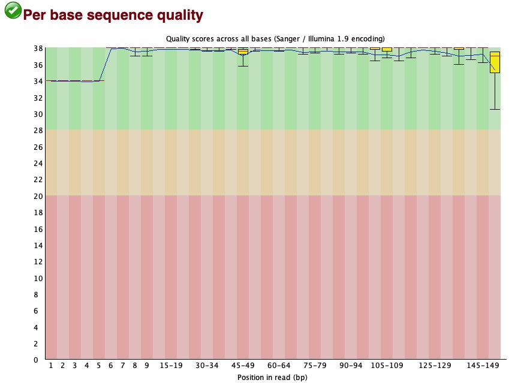
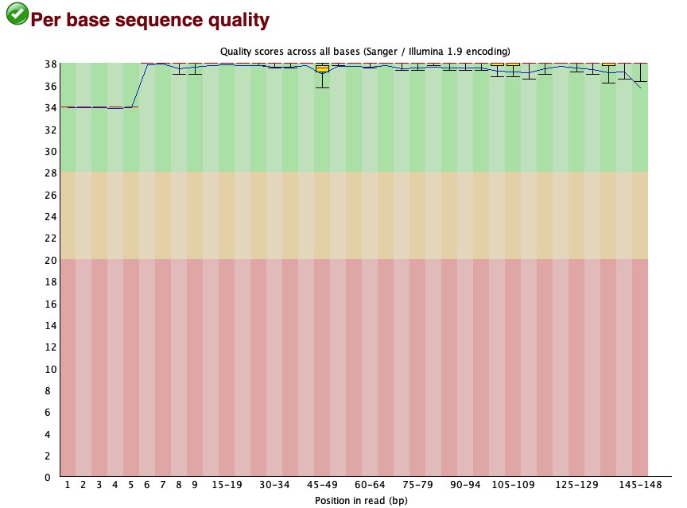
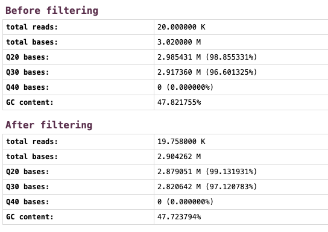

# Week 4: Downloading and Quality-Controlling Human Mitochondrial FASTQ Data

## Project background

This project extends the Week 2 analysis of the human mitochondrial reference genome NC_012920.1. I selected the SRA run SRR40580480 from a human mitochondrial amplicon experiment designed to study base editing at MT-ND4 and MT-ND5.

- Organism: Homo sapiens
- Platform: Illumina MiSeq
- Layout: paired-end
- Library strategy: AMPLICON
- Experiment focus: mitochondrial base-editing analysis targeting MT-ND4 and MT-ND5
- BioProject: PRJNA1526067
- Sample name used in this workflow: mtND4_ND5_base_editing

## SRA search findings (as of September 21, 2026)

Using the search query:

`("Homo sapiens"[Organism]) AND (mitochondrial[All Fields] OR mitochondrion[All Fields])`

The SRA search returned the following record counts for matching entries. These are SRA record counts returned by the search and are not necessarily unique studies. The listed platform and strategy counts are major categories and are not exhaustive.

- Total matching SRA records: 46,013
- Platform breakdown:
  - Illumina: 42,274
  - PacBio SMRT: 1,309
  - Ion Torrent: 841
  - Oxford Nanopore: 241
- Major library strategies:
  - RNA-Seq: 20,280
  - Amplicon: 13,139
  - Other: 4,252
  - WGS: 1,988
  - Targeted Capture: 1,575
  - WXS: 799
  - miRNA-Seq: 324
  - ChIP-Seq: 321

These numbers confirm that the amplicon strategy is a relevant and common design in mitochondrial sequencing data, and they support framing the present dataset as an amplicon-focused mitochondrial experiment.

## Workflow

The workflow used in this assignment follows a simple, reproducible command-line pipeline:

1. Prefetch SRR40580480.
2. Download the first 10,000 paired-end spots with fastq-dump.
3. Rename the raw FASTQ files to descriptive sample names.
4. Run FastQC on the raw reads.
5. Use fastp for paired-end adapter detection and quality filtering.
6. Require Phred 20 and a minimum read length of 50 bp.
7. Run FastQC again on the trimmed reads.

## Requirements and software used

This project requires the following tools:

- GNU Make
- SRA Toolkit (`prefetch`, `fastq-dump`)
- FastQC
- fastp
- Bash

The workflow uses the following variables in the Makefile:

- `SRA_ACCESSION := SRR40580480`
- `READ_LIMIT := 10000`
- `SAMPLE_NAME ?= mtND4_ND5_base_editing`
- `THREADS ?= 4`

## Directory organization

```text
.
├── Makefile
├── README.md
├── data/
│   ├── raw/
│   │   ├── mtND4_ND5_base_editing_R1.fastq
│   │   └── mtND4_ND5_base_editing_R2.fastq
│   └── trimmed/
│       ├── mtND4_ND5_base_editing_trimmed_R1.fastq
│       └── mtND4_ND5_base_editing_trimmed_R2.fastq
├── results/
│   ├── fastqc_raw/
│   ├── fastqc_trimmed/
│   └── fastp/
│       ├── fastp_report.html
│       └── fastp_report.json
└── images/
    ├── raw_fastqc.png
    ├── trimmed_fastqc.png
    └── fastp_summary.png
```

## Makefile targets

The project includes the following Make targets:

- `make download` — prefetches and downloads the first 10,000 read pairs
- `make qc_raw` — runs FastQC on the raw reads
- `make trim` — runs fastp paired-end cleaning and filtering
- `make qc_trimmed` — runs FastQC on the trimmed reads
- `make all` — runs the complete workflow in order
- `make clean` — removes generated data and prefetched SRA files

## Running the workflow

### Run the full workflow

```bash
make all
```

### Run individual steps

```bash
make download
make qc_raw
make trim
make qc_trimmed
```

### Change variables

The workflow is configurable through variables at the top of the Makefile. For example:

```bash
make THREADS=8 qc_raw
make SAMPLE_NAME=my_sample trim
make READ_LIMIT=5000 download
```

### Clean the project

```bash
make clean
```

This removes the generated `data/` and `results/` directories and cleans up the locally prefetched SRA accession directory.

## Results summary

The workflow was run successfully on the selected mitochondrial amplicon run. The following values were observed:

- Raw read pairs: 10,000
- Retained read pairs: 9,879
- Retained percentage: 98.79%
- Q20 before: 98.86%
- Q20 after: 99.13%
- Q30 before: 96.60%
- Q30 after: 97.12%
- Mean read length before: 151 bp
- Mean read length after: 146 bp
- Adapter-trimmed bases: 101,507
- Duplication rate: 87.26%

## Raw vs. trimmed comparison

| Metric | Raw reads | Trimmed reads |
| --- | ---: | ---: |
| Read pairs | 10,000 | 9,879 |
| Retained fraction | 100.00% | 98.79% |
| Q20 | 98.86% | 99.13% |
| Q30 | 96.60% | 97.12% |
| Mean read length | 151 bp | 146 bp |
| Adapter content | PASS | PASS |
| Per-base sequence quality | PASS | PASS |
| Per-sequence quality | PASS | PASS |
| Sequence-length distribution | PASS | WARN |
| Per-base sequence content | FAIL | FAIL |
| Duplication | FAIL | FAIL |
| Overrepresented sequences | FAIL | FAIL |
| R2 GC-content distribution | FAIL | FAIL |

## FastQC interpretation

The FastQC evaluation showed the expected pattern for targeted amplicon sequencing:

- Per-base and per-sequence quality passed before and after filtering.
- Adapter content passed before and after filtering.
- Per-base sequence content, duplication, and overrepresented sequences failed before and after processing.
- R2 GC-content distribution failed before and after processing.
- Sequence-length distribution changed from PASS to WARN after trimming, because trimming produced variable read lengths.

These observations are consistent with a targeted amplicon design rather than necessarily indicating poor data quality. The reads still have a high-quality base call profile, and the modest improvements in Q20 and Q30 indicate that fastp improved the read set in a useful but limited way.

## Interesting finding

The clearest biological signal in this dataset is that the data appear to be strongly shaped by the amplicon design and targeted mitochondrial region rather than by random shotgun sequencing biases. Duplication, biased sequence composition, overrepresented sequences, and unusual GC distribution are all features that can reasonably occur in targeted amplicon sequencing and do not automatically imply technical failure.

In other words, fastp improved the reads modestly and removed low-quality bases and adapter sequence, but it did not remove the underlying biological composition biases inherent to the targeted amplicon assay.

## Figures

### Raw FastQC



### Trimmed FastQC



### fastp summary



## AI Agent Use

This project was developed iteratively with the VS Code AI agent. The AI agent generated and refined the Makefile logic in steps, and the commands were tested directly in the terminal.

Key points from the workflow development:

- The initial attempt used `fasterq-dump` and `--maxSpotId`, but the installed SRA Toolkit version did not support those options.
- I checked `fasterq-dump --help` and confirmed that `fasterq-dump 3.4.1` does not support `-X` or `--maxSpotId`.
- The workflow was corrected to use `prefetch` followed by `fastq-dump --split-files -X 10000 --outdir data/raw SRR40580480`.
- The corrected workflow was then tested successfully.
- The final Makefile followed the tested commands without altering the validated download, QC, trimming, or post-trimming QC steps.

Important prompts used during iteration (not the full chat):

- "Create a simple Makefile that downloads only the first 10,000 reads from SRA accession SRR40580480 using fasterq-dump."
- "I ran make download, but fasterq-dump returned: Failed to call external services and Error 64. Diagnose the problem first. Do not edit the Makefile yet."
- "I successfully tested the workflow. The prefetch command downloaded SRR40580480, and vdb-validate confirmed that the archive is consistent."
- "Update the Makefile so the download target: 1. Creates data/raw. 2. Runs prefetch $(SRA_ACCESSION) --max-size 1G. 3. Runs fastq-dump --split-files -X $(READ_LIMIT). 4. Saves the FASTQ files in data/raw."
- "The download and renaming steps now work. Both paired-end FASTQ files contain exactly 10,000 reads."
- "Add a new Makefile target named qc_raw ..."
- "The fastp trimming step completed successfully ... Add a Makefile target named qc_trimmed ..."
- "All four steps have been tested successfully ... Add an all target ... and a clean target ..."

## References

- NCBI SRA: https://www.ncbi.nlm.nih.gov/sra
- SRR40580480: https://www.ncbi.nlm.nih.gov/sra/?term=SRR40580480
- PRJNA1526067: https://www.ncbi.nlm.nih.gov/bioproject/PRJNA1526067
- SRA Toolkit: https://github.com/ncbi/sra-tools
- FastQC: https://www.bioinformatics.babraham.ac.uk/projects/fastqc/
- fastp: https://github.com/OpenGene/fastp

## Conclusion

This project demonstrates a reproducible command-line workflow for downloading, renaming, quality assaying, and trimming mitochondrial amplicon reads from a paired-end Illumina run. Despite the expected amplicon-related bias flags in FastQC, the data were usable for downstream analysis, and fastp improved read quality while retaining nearly all read pairs.

The most important conclusion is that the biological structure of the mitochondrial amplicon experiment remains the dominant source of sequence-content and duplication signals, while technical quality remained acceptable after trimming.
