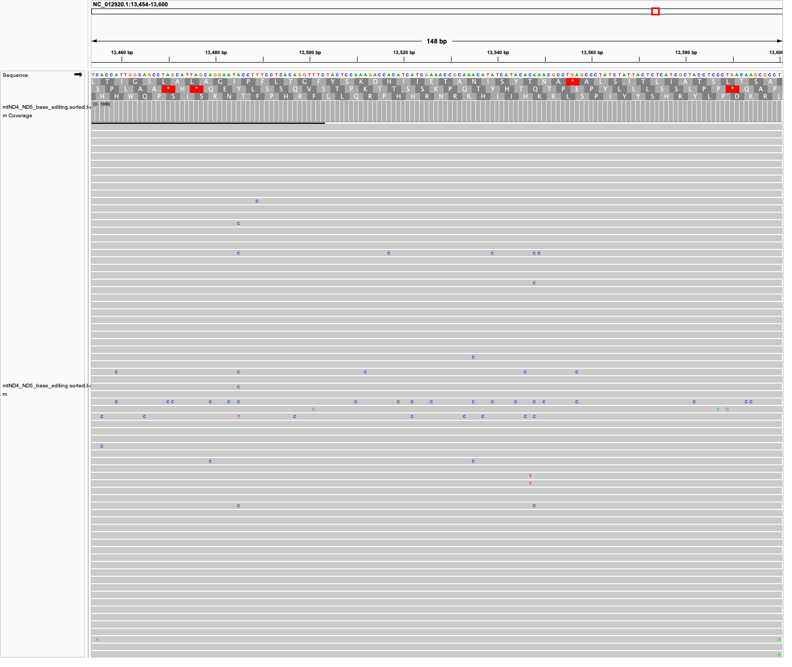
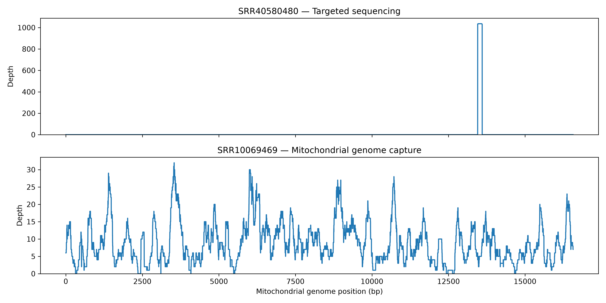

# Week 05: Generate a BAM File from Human Mitochondrial Reads

## Overview

This assignment extends my previous analyses of the human mitochondrial genome. I used the human mitochondrial reference genome NC_012920.1 from Week 02 and paired-end sequencing reads from SRR40580480 selected in Week 04. The reads were quality filtered, aligned to the mitochondrial reference with BWA-MEM, sorted into BAM format with samtools, and evaluated using alignment and coverage statistics.

## Reference Genome and Sequencing Data

- Reference: NC_012920.1
- Organism: Homo sapiens
- Genome: mitochondrial DNA
- Genome length: 16,569 bp
- Primary SRA accession: SRR40580480
- Sequencing layout: paired-end
- Raw read length: 151 bp
- Aligner: BWA-MEM
- BAM processing: samtools

## Number of Reads Selected

The assignment asks for a subset of reads expected to provide at least approximately 10x coverage.

For paired-end sequencing:

```text
N = (genome size × desired coverage) / (2 × read length)
```

Using a mitochondrial genome size of 16,569 bp, a target depth of 10x, and 151-bp paired-end reads:

```text
N = (16,569 × 10) / (2 × 151)
  = 548.64
```

I therefore selected **549 read pairs**.

This calculation assumes that the reads are distributed across the genome. The alignment results showed that this assumption does not hold for SRR40580480 because the sequencing library is highly targeted.

## Workflow

The primary workflow was:

1. Download 549 paired-end reads from SRR40580480.
2. Run FastQC on the raw reads.
3. Filter and trim reads with fastp.
4. Run FastQC on the filtered reads.
5. Copy the NC_012920.1 mitochondrial reference from Week 02.
6. Index the reference using BWA.
7. Align the reads using BWA-MEM.
8. Sort the alignments into BAM format using samtools.
9. Index the BAM file.
10. Calculate alignment statistics with `samtools flagstat`.
11. Calculate per-base coverage with `samtools depth`.

The complete primary workflow can be run with:

```bash
make
```

## Directory Structure

```text
week05/
├── Makefile
├── README.md
├── data/
│   ├── comparison/
│   │   └── coverage.txt
│   └── reference/
│       └── NC_012920.1.fa
├── images/
│   ├── SRR40580480_IGV.png
│   └── coverage_comparison.png
├── scripts/
│   └── plot_coverage.py
└── results/
    ├── alignment/
    │   ├── coverage.txt
    │   └── mtND4_ND5_base_editing.flagstat.txt
    ├── fastp/
    │   ├── fastp_report.html
    │   └── fastp_report.json
    ├── fastqc_raw/
    └── fastqc_trimmed/
```

Raw FASTQ files, BAM files, BAM indexes, BWA index files, and other large intermediate files are excluded from version control through `.gitignore`. They can be regenerated using the Makefile.

The Makefile uses output files as dependencies, so completed steps are not unnecessarily repeated.

## Read Quality and Filtering

The 549 input read pairs contained 1,098 reads. After fastp filtering, 1,038 reads (519 pairs) were retained.

Quality improved after filtering:

| Metric | Before filtering | After filtering |
| --- | ---: | ---: |
| Read pairs | 549 | 519 |
| Total reads | 1,098 | 1,038 |
| R1 Q20 | 97.47% | 98.76% |
| R1 Q30 | 93.54% | 95.95% |
| R2 Q20 | 91.32% | 93.80% |
| R2 Q30 | 80.97% | 84.41% |

fastp removed 60 low-quality reads. Adapter trimming was also performed during preprocessing.

## Alignment Results

The filtered reads were aligned to NC_012920.1 using BWA-MEM.

`samtools flagstat` reported:

- Primary reads: 1,038
- Mapped reads: 1,036
- Mapping rate: **99.81%**
- Properly paired reads: 1,026
- Properly paired rate: **98.84%**
- Singletons: 2 (0.19%)

Therefore, nearly all retained reads successfully aligned to the mitochondrial reference.

## Coverage

Despite the very high mapping rate, coverage across the mitochondrial genome was extremely nonuniform.

- Mean depth: **9.19x**
- Minimum depth: **0x**
- Maximum depth: **1,036x**
- Positions with coverage: **147 / 16,569**
- Genome covered at ≥1x: **0.89%**
- Covered interval: approximately **13,454–13,600 bp**

The covered interval falls within the **MT-ND5** region. Thus, the theoretical calculation predicted approximately 10x mean coverage based on the number of sequenced bases, but the reads were concentrated within a small region rather than distributed throughout the mitochondrial genome.

This illustrates the distinction between **depth of coverage** and **breadth of coverage**. A high mapping percentage does not necessarily mean that the entire reference genome is well covered.

## IGV Visualization

The BAM file was visualized in IGV. The alignment shows a dense pileup of reads in the targeted region around positions 13,454–13,600.



The IGV result agrees with the `samtools depth` analysis: the reads align very deeply to a small region while most of the mitochondrial genome has no coverage.

## Exploratory Comparison with a Broader Mitochondrial Dataset

Because SRR40580480 produced highly localized coverage, I performed an additional exploratory alignment using **SRR10069469** to examine how a broader mitochondrial sequencing dataset would differ.

This comparison was not used to replace the Week 04 dataset. **SRR40580480 remains the primary dataset for the assignment.**

For the comparison, I selected **553 paired-end reads** from SRR10069469 based on its 150-bp paired-end read length:

```text
N = (16,569 × 10) / (2 × 150)
  = 552.3
```

Therefore, 553 read pairs were selected.

The exploratory comparison produced:

| Metric | SRR40580480 | SRR10069469 |
| --- | ---: | ---: |
| Mean depth | 9.19x | 8.92x |
| Maximum depth | 1,036x | 32x |
| Genome covered ≥1x | 0.89% | 98.10% |
| Primary mapping rate | 99.81% | 96.56% |

For SRR10069469:

- **98.10%** of positions had ≥1x coverage
- **76.00%** had ≥5x coverage
- **39.59%** had ≥10x coverage
- **6.01%** had ≥20x coverage
- **1.90%** had 0x coverage
- Mean depth was **8.92x**
- Coefficient of variation of depth was **0.65**

Neither dataset showed perfectly uniform coverage. However, SRR10069469 provided substantially broader coverage across the mitochondrial genome, whereas SRR40580480 was extremely concentrated within a small region.

Because this was an exploratory comparison, SRR10069469 was aligned directly and was not processed through the complete primary fastp/FastQC workflow used for SRR40580480. Therefore, the comparison is intended to illustrate differences in coverage distribution rather than serve as a fully matched benchmark between the two datasets.

## Coverage Comparison



The coverage profiles show a striking difference between the two datasets. SRR40580480 produces a narrow region of extremely high coverage, while SRR10069469 distributes reads across nearly the entire mitochondrial genome.

The figure also demonstrates why **mean coverage alone can be misleading**. Both datasets had a mean depth close to 9x, but their breadth and distribution of coverage were very different.

## Errors and Variation in the Alignment

The primary dataset had a very high mapping rate and proper-pair rate, indicating that most retained reads were compatible with the mitochondrial reference.

The major issue was not failure to align but the highly localized distribution of the reads.

Mismatches visible in IGV could potentially reflect sequencing errors, biological variation, or features related to the original experiment. This analysis does not attempt to classify individual mismatches as true variants.

## Software

The primary workflow requires:

- GNU Make
- SRA Toolkit (`prefetch`, `fastq-dump`)
- FastQC
- fastp
- BWA
- samtools
- Bash

The coverage comparison figure additionally uses:

- Python
- pandas
- matplotlib

The BAM alignment was visually inspected using IGV.

## Reproducibility

Run the primary analysis with:

```bash
make
```

The main generated alignment files are:

```text
results/alignment/mtND4_ND5_base_editing.sorted.bam
results/alignment/mtND4_ND5_base_editing.sorted.bam.bai
results/alignment/mtND4_ND5_base_editing.flagstat.txt
results/alignment/coverage.txt
```

The coverage comparison figure was generated with:

```bash
python scripts/plot_coverage.py
```

Generated FASTQ, BAM, BAM index, BWA index, and other intermediate files are excluded from version control where appropriate because they can be reproduced from the workflow.

## Conclusion

Using 549 paired-end reads was theoretically sufficient for approximately 10x mean coverage of the 16,569-bp mitochondrial genome. The observed mean depth was close to this estimate at **9.19x**, and **99.81%** of the filtered reads mapped successfully.

However, only **0.89%** of the mitochondrial genome was covered because the reads were highly concentrated within the MT-ND5 region. Therefore, the primary dataset did not provide uniform genome-wide mitochondrial coverage.

The exploratory comparison reinforced that similar mean sequencing depth can produce very different coverage patterns. SRR10069469 had a similar mean depth of **8.92x** but covered **98.10%** of the mitochondrial genome at ≥1x. Its coverage was still variable, but it was substantially broader than SRR40580480.

Overall, this analysis demonstrates why both **depth of coverage and breadth of coverage** should be considered when evaluating short-read alignments.

## References

- NCBI Sequence Read Archive (SRA): https://www.ncbi.nlm.nih.gov/sra
- SRR40580480: https://www.ncbi.nlm.nih.gov/sra/?term=SRR40580480
- SRR10069469: https://www.ncbi.nlm.nih.gov/sra/?term=SRR10069469
- NCBI human mitochondrial reference genome NC_012920.1: https://www.ncbi.nlm.nih.gov/nuccore/NC_012920.1
- BWA: https://github.com/lh3/bwa
- SAMtools: https://www.htslib.org/
- FastQC: https://www.bioinformatics.babraham.ac.uk/projects/fastqc/
- fastp: https://github.com/OpenGene/fastp
- IGV: https://igv.org/